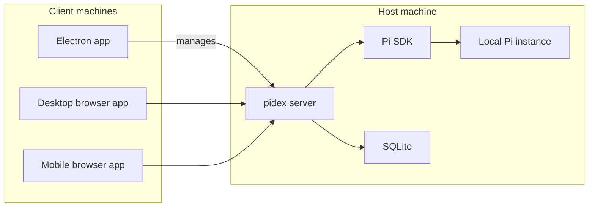

# pidex Architecture

## Overview



- pidex is local-first and Pi-only, without a cloud service, relay, or daemon.
- Electron and browser clients may run on the host or another machine.
- The server owns execution, authorization, ordering, and durable state.

## Repository

```text
apps/
├── desktop/   # Electron lifecycle, native UI, and server supervision
├── server/    # HTTP/WS host, Pi integration, metadata, auth, and Tailscale
└── web/       # Shared responsive desktop/mobile client

packages/
└── api/       # Browser-safe schemas, DTOs, and protocol version

docs/          # Product, architecture, and technical references
e2e/           # Browser-level end-to-end coverage
scripts/       # Development and smoke-check utilities
```

- Apps do not import each other; Pi and Tailscale stay in `apps/server`.
- `packages/api` stays browser-safe and implementation-neutral; split only for reuse.
- Renderers stay sandboxed; preload is narrow and all clients use the host API.

## Security and remote access

- A host secret issues desktop bootstrap, pairing credentials, and WebSocket tickets.
- Device credentials are revocable; server roles restrict clients to trusted projects.
- The loopback server owns one Serve route; Tailscale provides transport, not auth.

## Projects and sessions

- Projects are canonical paths, revalidated before Pi opens them; remote use needs trust.
- Managed sessions have stable IDs, one project, one JSONL file, and a revision.
- Each session owns one runtime and active run; sessions can run concurrently.

## Protocol and continuity

- HTTP mutations use action, session, revision, and run IDs for durable idempotency.
- WebSocket replays complete event ranges; otherwise it sends a replacement snapshot.
- Disconnects do not stop Pi; crash-ambiguous work is acknowledged, never rerun.

## Data ownership

- **Pi JSONL:** Messages, branches, compaction, and Pi session state.
- **SQLite:** Projects, sessions, runs, actions, clients, and routes; writes are atomic.
- **Client storage:** Protected secrets plus browser drafts, actions, and preferences.

## SQLite schema

### `workspaces`

| Column      | Type | Constraint  |
| ----------- | ---- | ----------- |
| `id`        | TEXT | Primary key |
| `path`      | TEXT | Unique      |
| `opened_at` | TEXT |             |

### `session_state`

| Column                     | Type    | Constraint  |
| -------------------------- | ------- | ----------- |
| `session_key`              | TEXT    | Primary key |
| `revision`                 | INTEGER |             |
| `run_id`                   | TEXT    |             |
| `prompt_action_id`         | TEXT    |             |
| `run_status`               | TEXT    |             |
| `requires_acknowledgement` | INTEGER |             |
| `updated_at`               | TEXT    |             |

### `actions`

| Column           | Type    | Constraint  |
| ---------------- | ------- | ----------- |
| `action_id`      | TEXT    | Primary key |
| `client_id`      | TEXT    |             |
| `session_key`    | TEXT    |             |
| `kind`           | TEXT    |             |
| `request_digest` | TEXT    |             |
| `run_id`         | TEXT    |             |
| `status`         | TEXT    |             |
| `revision`       | INTEGER |             |
| `created_at`     | TEXT    |             |
| `updated_at`     | TEXT    |             |

- `actions.session_key` logically references `session_state`; there is no foreign key.
- V1 adds sessions, clients, pairing grants, routes, and settings.

## API

The current protocol version is 3.

```text
GET    /api/health
GET    /api/bootstrap

POST   /api/workspaces/open
GET    /api/workspaces/:workspaceId/sessions
POST   /api/workspaces/:workspaceId/trust

POST   /api/chats
POST   /api/chats/resume
GET    /api/chats/:chatId
DELETE /api/chats/:chatId

POST   /api/chats/:chatId/messages
POST   /api/chats/:chatId/abort
POST   /api/chats/:chatId/interrupted/acknowledge
DELETE /api/chats/:chatId/queue
PATCH  /api/chats/:chatId/config
POST   /api/chats/:chatId/rename
POST   /api/chats/:chatId/compact
POST   /api/chats/:chatId/dialog

GET    /api/chats/:chatId/transcript
GET    /api/chats/:chatId/tools/:resourceId
WS     /api/ws
```

- Zod validates request and response boundaries.
- Mutations use CSRF, action IDs, and expected session revisions.
- Planned V1 adds auth, pairing, devices, WebSocket tickets, and Serve management.

## Lifecycle

- Electron starts, monitors, restarts, and stops server; window close is not Quit.
- Quit stops work, marks runs interrupted, flushes metadata, and removes owned Serve.
- Missing records stay visible; recovery errors block startup without JSONL edits.

## Stack

- Electron, Svelte, Vite, Tailwind, Zod, Node HTTP, `ws`, SQLite, and Pi SDK.
